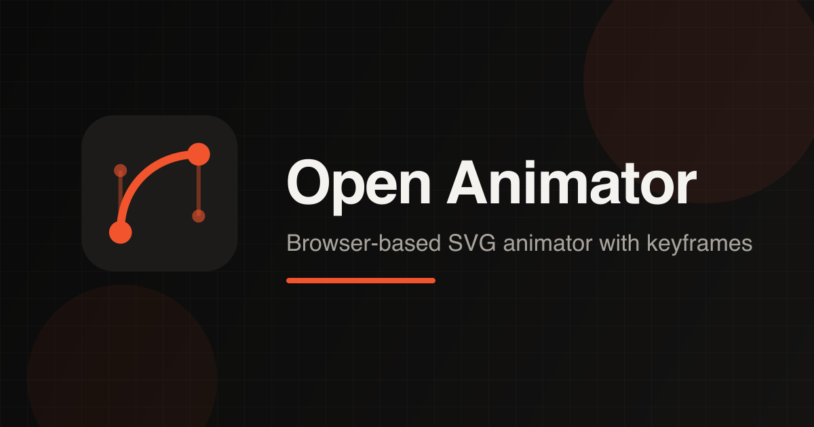

# Open Animator

[](https://vgomx.github.io/open-animator/)
[](https://github.com/vgomx/open-animator/actions/workflows/ci.yml)
[](LICENSE)
[](CHANGELOG.md)

Browser-based SVG animator for authoring simple shape animations with keyframes. Portfolio side project by [Vitor Gomes](https://vitorgomes.design).

[Live demo](https://vgomx.github.io/open-animator/) · [Changelog](CHANGELOG.md) · [Report an issue](https://github.com/vgomx/open-animator/issues)

<p align="center">
  
</p>

## Tech stack

[](https://react.dev/)
[](https://www.typescriptlang.org/)
[](https://vite.dev/)
[](https://tailwindcss.com/)
[](https://www.radix-ui.com/)
[](https://zustand.docs.pmnd.rs/)
[](https://vitest.dev/)
[](https://vite-pwa-org.netlify.app/)

Also uses **lottie-web** for Lottie preview, **oxlint** for linting, and **jsdom** in tests.

## Getting started

```bash
npm install
npm run dev
```

Open the local URL printed by Vite (configured as `http://127.0.0.1:5173`).

### Scripts

| Command | Description |
|---------|-------------|
| `npm run dev` | Start the development server |
| `npm run build` | Generate brand assets, typecheck, and production build |
| `npm run preview` | Preview the production build |
| `npm run test` | Run unit tests (Vitest) |
| `npm run lint` | Run oxlint |
| `npm run generate:brand-assets` | Regenerate favicons and Open Graph image |

## Features

### Editor
- Light, dark, and system theme with frosted-glass chrome
- Canvas rulers, guides, snap, and floating tool palette
- Layers and properties panels, document tabs, and recent files
- Welcome screen, keyboard shortcuts, and settings

### Tools
- **Select** — move, resize, rotate, multi-select
- **Hand / Zoom** — pan and zoom (trackpad pinch supported)
- **Node / Pen** — path editing and bezier drawing
- **Rect / Ellipse / Text** — create shapes on canvas

### Animation
- Keyframes for transform, opacity, fill, and stroke with easing
- Custom cubic-bezier editor and record mode
- Timeline scrubbing, loop playback, and onion skin
- Layer groups with shared transform keyframes

### Import & export
- **Import:** SVG (shapes, groups, gradients, masks, SMIL), HTML animation, Lottie JSON (subset)
- **Export:** static SVG, animated SVG, HTML, WebM, GIF, CSS keyframes, React component, Lottie JSON (subset)

> Tip: in the live demo, open **File → Samples → Train Performance** for a layered SVG motion sample.

## Project structure

```text
src/
  components/   # Canvas, shell, timeline, and UI
  editor/       # Store, animation, tools, and types
  io/           # Import, export, and project persistence
  lib/          # App constants, preferences, and helpers
```

## Contributing

Issues and pull requests are welcome. Please:

1. Open an issue for larger changes when useful
2. Keep PRs focused
3. Run `npm run lint`, `npm run test`, and `npm run build` before opening a PR

CI runs build, lint, and tests on every pull request to `main`.

## License

MIT — see [LICENSE](LICENSE).
